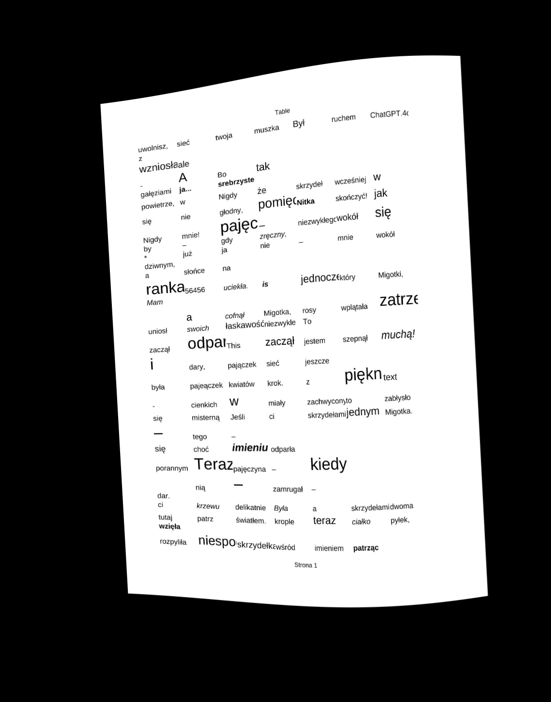
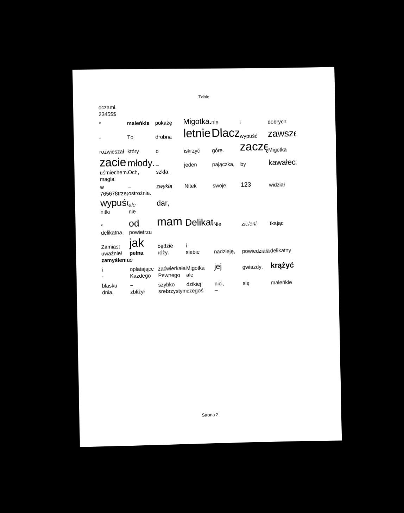
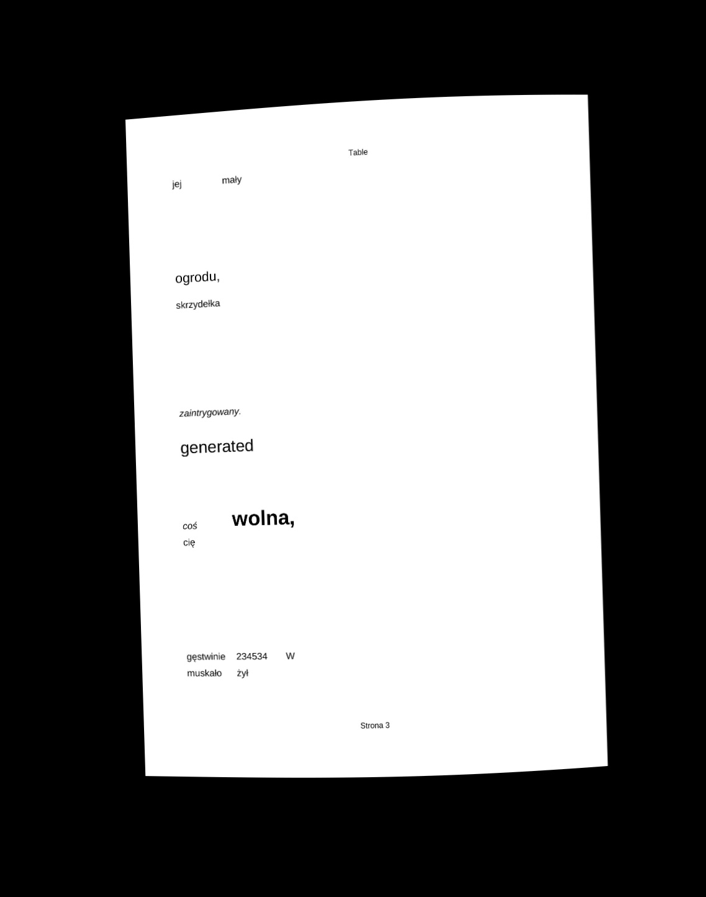
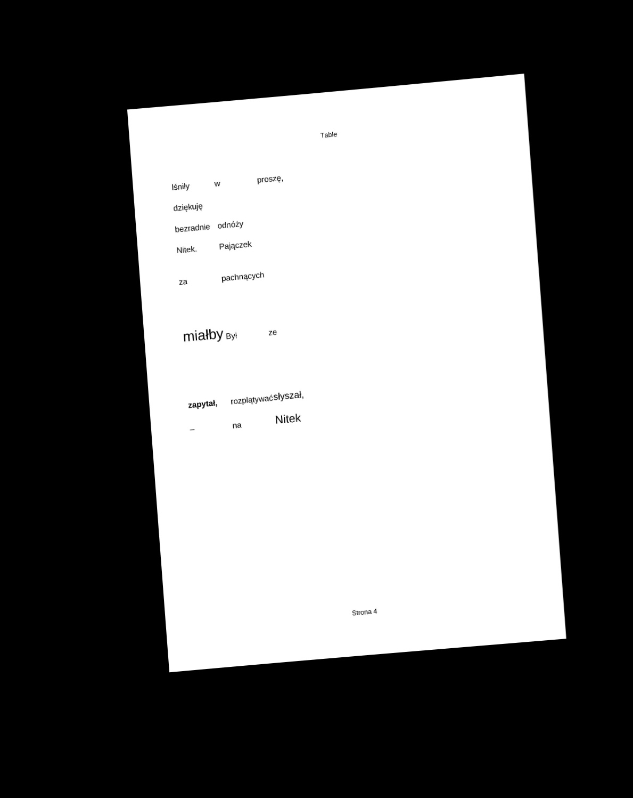

# BookScanner

<p align="center">
  <br>
  <strong>Book Scanner</strong>
</p>

## Description

This project aims to build a neural network model inspired by U-Net architecture to automatically straighten curved pages from books, making them appear as if scanned flat.

The system consists of:

- A mobile application for capturing images

- A server-side component for storing and processing images using AI

- A neural network training module with a data generator

<!-- ## Image Processing Example -->
### How does the data generator work?

This tool generates synthetic document images with randomized table structures and formatting. It creates ODS files, converts them to PDF, and then converts them to JPEG images. Each image is augmented with 3D rotations and sinusoidal distortions to simulate real-world imperfections. Corresponding deformation grids are also produced. Document content is randomized to prevent the model from overfitting grid predictions to text content.

Below are sample generated images:

<p align="center">
  
  
  
  
</p>

## Installation

To run the project locally:

```bash
git clone https://github.com/McQbis/BookScanner.git
cd BookScanner
```

### Server configuration

```bash
cd server
pip install -r requirements.txt
```
Create an ```.env``` file and provide the following environment variables:

```bash
# Secret key for Django – used for signing cookies, sessions, etc.
SECRET_KEY=
# Secret key to encryption keys of users
MASTER_KEY=
# Enables Django debug mode (only use True in development!)
DEBUG=True
# List of allowed domains/IPs that can access the app
ALLOWED_HOSTS=
# Domains allowed to make cross-origin requests (CORS)
CORS_ALLOWED_ORIGINS=

# Name of your PostgreSQL database
DB_NAME=
# Database username
DB_USER=
# Database password
DB_PASSWORD=
# Host address of your database
DB_HOST=
# Port your database is listening on (5432 is the default for PostgreSQL)
DB_PORT=5432


# Should session cookies only be sent over HTTPS?
SESSION_COOKIE_SECURE=
# Should CSRF cookies only be sent over HTTPS?
CSRF_COOKIE_SECURE=
```

To access the Django admin panel, create a superuser:

```bash
python manage.py createsuperuser
```

Follow the prompts to enter a username, email, and password. Run other commands: 

```bash
python manage.py migrate
python manage.py collectstatic
```

Now you can run the server:

```bash
python manage.py runserver X.X.X.X:port
```

### Mobile application configuration

```bash
cd mobile_app/BookScanner
npm install
```

Create an ```.env``` file and provide the following environment variables:

```bash
EXPO_PUBLIC_API_BASE_URL=<server-address>/api
EXPO_PUBLIC_API_TIMEOUT=5000
```

Connect your Android device or run the emulator. And then launch the application:

```bash
npx expo run:android
```

### AI training module configuration

The folder ```server/ai_model/``` contains a module for training neural network models. You need to install libreoffice and poppler-utils.

```bash
apt install libreoffice
apt-get install poppler-utils
```

Make sure you have already installed all the packages from the [requirements.txt](#server-configuration) file.

## Usage

### Server usage

The admin site can be found at ```<server-address>/zone_51_hehhe/```.

The server stores users' encrypted photos, where each user has their encrypted key used to encrypt their photos. The keys are encrypted using the ```MASTER_KEY``` in your ```.env``` file. Photos and user keys are in the ```media/``` folder.

#### The application exposes two endpoints for retrieving decrypted user photos:

**1. Authenticated Photo Access** 
```http
GET /api/photos/view/<photo_id>/
```

- Requires user authentication (JWT or session-based)

- Decrypts the image server-side and returns it as a FileResponse

- Suitable for internal tools, admin panels, or secure web apps

- **WARNING**: Not ideal for React Native or similar environments where images are embedded via URI

**Response:**

**- 200** OK with decrypted image content

**- 404** Not Found if photo doesn’t exist or decryption fails

**2. Temporary Signed URL**
```http
GET /api/photos/temp-view/<signed_value>/**
```

- Does not require authentication

- The signed_value is a time-limited, cryptographically signed token that maps to a specific photo

- Designed for mobile applications (e.g. React Native) where images are embedded via direct URIs

- Safer and more efficient for frontend usage

```jsx
<Image source={{ uri: '<server-addreess>/api/photos/temp-view/abc123xyz/' }} />
```

**Response:**

***- 200*** OK with decrypted image content

***- 403*** Forbidden if the link is invalid or expired

***- 404*** Not Found if the photo does not exist

### AI training module usage

You can find the AI training source code in the ```ai_model/src/``` folder.

#### Data Generator

The constructor requires a path to a text file, which will be used to generate random document content:
```python
generator = DocumentImageGenerator("/src/assets/text.txt")
```
If you want to change the content of the documents during training, you can provide the path to the new text file:
```python
generator.set_text_from_file_path(file_path: str)
```
You can set the seed of the generator, and thus you can generate the same dataset, for example, for model evaluation, every epoch:
```python
generator.set_seed(seed: int):
```
To generate a mini batch of photos, you can call the function, where you can specify the size of the photo:
```python
generator.generate_new_images(image_scale: float = 0.4)
```
If you want to delete old data and generate new data every epoch, for example, then you can call at the beginning of each epoch and still specify the size of the photo:
```python
generator.regenerate_data(self, image_scale: float = 0.4)
```
With these methods, you can freely manage your training data.

#### Neural Network Handler

This class manages the full lifecycle of training and evaluating the neural network model.

To initialize the handler, pass in a PyTorch model and a document generator:
```python
handler = NeuralNetHandler(
    model=your_model,
    generator=your_generator,
    device="cuda",
    epochs=30,
    learning_rate=0.001,
    num_batches=300,
    name="model"
    base_model_class=None
)
```
Arguments:

- model: PyTorch model object or path to a .pt file. If a path is provided, the model is loaded from disk.

- generator: Instance of DocumentImageGenerator, responsible for generating synthetic training data.

- device: "cuda" or "cpu" – device to train the model on.

- epochs: Number of epochs to train for.

- learning_rate: Learning rate used by the Adam optimizer.

- num_batches: Number of mini-batches per epoch.

- name: Optional name identifier for the model (used in logs/saving checkpoints).

- base_model_class: **Required if model is a path**; class used to instantiate model before loading weights

If you want to train a new model, but keep the training parameters:
```python
handler.set_model(model_or_path, name="new_model")
```
If you want to use a different generator, but keep the model:
```python
handler.set_generator(generator)
```
You can set the generator seed from the handler:
```python
handler.set_generator_seed(seed: int)
```
To begin training:
```python
handler.train()
```
To begin evaluation:
```python
handler.evaluate()
```
You can access the training and validation loss history:
```python
handler.get_train_losses()
handler.get_val_losses()
```
To save the current model state:
```python
handler.save_model("path/to/model.pth")
```
WARNING: This class requires both a model and a generator to be set before training or evaluation.

You can conveniently manage the training logic in the ```train.py``` file.

You can conveniently manage the evaluation logic in ```evaluate.py``` file.

## Technologies Used

This project is built using the following technologies and libraries:

### Frontend
- **React Native (Expo)** – for building the mobile application
- **Axios** – for handling HTTP requests
- **Expo Secure Store** – for secure data storage

### Backend
- **Django** – a high-level Python web framework for backend development.
- **Django REST Framework** – to build RESTful APIs.
- **Django REST Framework Simple JWT** – for JWT-based authentication.

### Database
- **PostgreSQL**

### Python Libraries for Data Processing
- **PyTorch** – for machine learning and deep learning tasks.
- **OpenCV-python-headless** – computer vision tasks without GUI dependencies.
- **matplotlib** – for creating visualizations and plots.
- **cryptography** – for cryptographic operations and security.

## Collaboration

This project is open to collaboration!  

If you're interested in contributing, improving features, or reporting issues, feel free to reach out.

You can contact me by opening a **discussion in this repository**.
